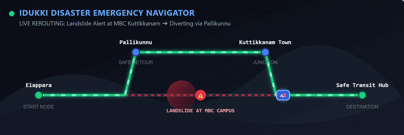

<p align="center">
  
</p>

  <br />

  <h1>🌧️ NerReksha</h1>
  
  <h3>Offline-First Emergency Coordination Platform</h3>

  <p>
    
    
    
    
    
  </p>

  <p>
    <strong>Built for emergencies. Designed for resilience. Powered by the community.</strong>
  </p>
</div>

---

## 📖 Overview

**NerReksha** is an **Offline-First Progressive Web Application (PWA)** that helps communities coordinate during natural disasters such as floods, landslides, heavy rainfall, and storms.

Unlike conventional navigation or emergency applications that rely on internet connectivity, NerReksha is designed to remain fully functional even when communication infrastructure fails.

The platform enables users to:

- 🗺️ Navigate using safer routes
- 🚨 Send SOS emergency requests
- ⚠️ Report hazards
- 🏠 Share community resources
- 📍 Find nearby relief facilities

All information is stored locally, making the application completely usable without a backend server.

---

# ✨ Features

## 🗺️ Interactive Emergency Map

The interactive map serves as the command center of NerReksha.

It displays:

- 📍 Your current location
- 🌊 Floods
- ⛰️ Landslides
- 🌳 Fallen Trees
- 🚧 Road Closures
- 🚨 SOS Requests
- 🏠 Community Resources
- 🏥 Relief Camps
- 🍱 Food Distribution
- 💧 Drinking Water
- 🔋 Charging Stations
- 🚻 Public Toilets
- 🚜 Volunteer Resources

Users can filter different marker categories to quickly find the information they need.

---

## 🛣️ Safe Route Navigation

Unlike traditional navigation systems that calculate the shortest path, NerReksha prioritizes **safety**.

Every reported hazard creates a danger zone.

When a destination is selected, the application:

- Detects hazard zones
- Avoids unsafe roads
- Calculates safer alternative routes
- Warns users when no safe path exists

This helps prevent users from unknowingly travelling through flooded roads or landslide-prone areas.

---

## 🚨 SOS Emergency System

Users can send emergency rescue requests within seconds.

Each SOS contains:

- Current GPS location
- Emergency type
- Number of affected people
- Optional contact information
- Additional notes

Submitted SOS requests immediately appear on the map.

Responders can update their status:

- ⏳ Waiting
- 🚑 Rescue On The Way
- ✅ Resolved

Resolved requests remain visible with a different marker style.

---

## ⚠️ Hazard Reporting

Community members can instantly report hazards.

Supported reports include:

- Flood
- Landslide
- Fallen Tree
- Road Blocked
- Bridge Damage
- Other

Every report is immediately:

- Stored locally
- Added to the map
- Saved for future sessions

Each report includes:

- Type
- Description
- Timestamp
- Confirmation Count
- Status

---

## 🏠 Community Resources

Instead of only displaying shelters, NerReksha allows communities to share any useful emergency resource.

Supported resource types include:

- 🏠 Relief Camp
- 🏥 Temporary Medical Camp
- 🍱 Food Distribution
- 💧 Drinking Water
- 🔋 Charging Station
- 🚻 Public Toilet
- 🚜 Volunteer Resource
- ⛽ Fuel Availability
- 📦 Supply Distribution
- 📍 Other

Each resource displays:

- Resource Name
- Type
- Capacity
- Contact Information
- Facilities Available
- Description

Resources can also be removed when they are no longer available.

---

# 🌐 Offline-First Design

Offline capability is the core feature of NerReksha.

## Progressive Web App (PWA)

The application installs directly onto mobile devices.

Using a Service Worker, it caches:

- HTML
- CSS
- JavaScript
- Icons
- Application Assets

The app launches even without internet.

---

## GPS Without Internet

GPS continues working even when mobile data is unavailable.

NerReksha uses GPS for:

- Hazard Reports
- SOS Requests
- Community Resources
- User Navigation

---

# 🚀 How It Works

## Report a Hazard

```
Open App
↓
Report
↓
Select Hazard
↓
Submit
↓
Stored Locally
↓
Displayed on Map
```

---

## Request Rescue

```
Open App
↓
SOS
↓
Enter Details
↓
Submit
↓
SOS Appears On Map
↓
Responder Updates Status
```

---

## Add Community Resource

```
Community Resources
↓
Enter Details
↓
Save
↓
Displayed On Map
```

---

# 💡 Why NerReksha?

During disasters:

- Internet connectivity is unreliable.
- Roads become blocked unexpectedly.
- Traditional navigation apps become inaccurate.
- Communities struggle to coordinate.

NerReksha solves these challenges by enabling communities to collaboratively build their own emergency map.

Instead of depending on cloud services, users contribute:

- Hazard reports
- rescue requests
- Relief locations
- Community resources

This makes emergency information:

- Faster
- More local
- More accurate
- Available offline

---

# 👥 Who Can Use It?

### 🚶 Civilians

- Find safe routes
- Locate food and water
- Discover nearby relief camps
- Request emergency assistance

---

### 🚑 Emergency Responders

- View hazard reports
- Track SOS requests
- Update rescue status
- Locate affected communities

---

### 🤝 Volunteers

- Report blocked roads
- Add community resources
- Create temporary relief camps
- Help coordinate local response

---

# 🛠️ Technology Stack

| Technology | Purpose |
|------------|---------|
| HTML5 | Structure |
| CSS3 | Styling |
| Vanilla JavaScript | Application Logic |
| Leaflet.js | Interactive Maps |
| OpenStreetMap | Mapping |
| IndexedDB | Offline Storage |
| Service Worker | Offline Caching |
| Progressive Web App | Installable Experience |

---

Access the website through https://mev1n.github.io/NerReksha/>

---

# 🔮 Future Improvements

- 🔄 Community synchronization
- ☁️ Optional cloud backup
- 🤖 AI-assisted hazard detection
- 📷 Image attachments
- 📡 Mesh networking
- 🔔 Push notifications
- 👥 Community verification system
- 📊 Disaster analytics dashboard

---

# ❤️ Built for Communities

> **When infrastructure fails, communities should still be able to help each other.**

NerReksha combines offline resilience, crowdsourced information, and a simple mobile-first experience to help people stay informed, connected, and safe during emergencies.
